  <picture>
    <source media="(max-width: 760px) and (prefers-color-scheme: dark)" srcset="./assets/hero/builder-profile-v2-dark.svg">
    <source media="(max-width: 760px)" srcset="./assets/hero/builder-profile-v2-dark.svg">
    <source media="(prefers-color-scheme: dark)" srcset="./assets/hero/builder-profile-v2-dark.svg">
    <source media="(prefers-color-scheme: light)" srcset="./assets/hero/builder-profile-v2-dark.svg">
    
  </picture>

  <a href="https://siseraportfo.vercel.app/"><strong>View Portfolio</strong></a> 

## Hey, I'm Siti Serli Aviva 👋

I'm a **student and tech enthusiast** from **SMKN 1 Probolinggo**, Indonesia. I am passionate about **web development, UI/UX design, and software engineering**, constantly learning and building new digital products.

I enjoy taking ideas and converting them into clean, functional websites and web applications while continuing to expand my skills in technology.

## What I'm Learning & Building

- **Web Development:** Creating modern, responsive, and user-friendly websites.
- **Frontend Systems:** Building interfaces using modern design principles and clean code.
- **Project Portfolios:** Developing personal and school projects to sharpen programming logic.

## Selected Work

| Project | What I built | My role · Current state |
| --- | --- | --- |
| [**SIKAS System**](https://sikas.infinityfreeapp.com/) | A web-based application designed to streamline financial or administrative tracking. | Developer In Development |
| [**Hitung HPP Website**](https://sisera9.github.io/Website-Hiitung-HPP/) · [Repository](https://github.com/sisera9/Website-Hiitung-HPP) | A web calculator tool to help calculate Cost of Goods Sold (HPP / Harga Pokok Penjualan) efficiently. | Developer Active Development |

## Featured Links

| Platform | Link | Description |
| --- | --- | --- |
| **Portfolio** | [siseraportfo.vercel.app](https://siseraportfo.vercel.app/) | My personal showcase & latest projects |
| **Instagram** | [@tili_vaa](https://www.instagram.com/tili_vaa/) | Social profile & daily journey |
| **GitHub** | [sisera9](https://github.com/sisera9) | Open-source repositories & code |

## Tools & Tech Stack

`HTML` · `CSS` · `JavaScript` · `Git` · `GitHub` · `VS Code` · `Vercel` · `InfinityFree`· `React`· `Bootstrap`

## Contribution Trail

  

---

  Learning, building, and growing • Student at SMKN 1 Probolinggo

